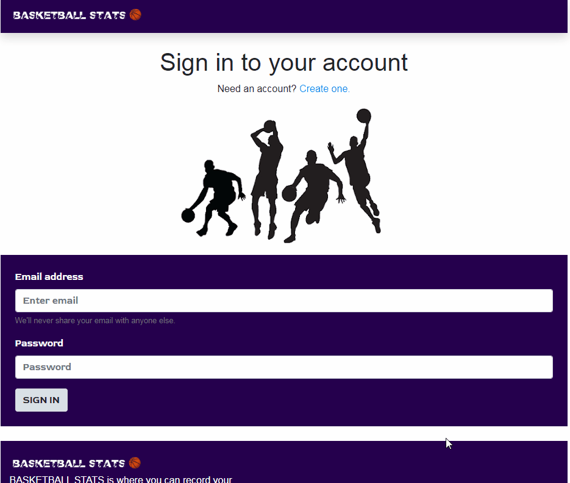

# Basketball Stats
A MERN application that logs an individual's basketball stats

## Description 
BASKETBALL STATS is where you can record your performance, recognise your strengths and weaknesses; and view your progress over time. Use BASKETBALL STATS to be the best player you can be! A user can log points, fouls, assists, rebounds, steals and game time. Once the game is over they are able to view their stats graphically in a table and/or donut charts. This application uses Mongodb, Express, React, Node, React-Bootstrap, d3 for charts and Passport for authentication.

 ) ) 

This app  uses [Create React App](https://github.com/facebook/create-react-app) and a React Bootstrap CSS Framework. 

## Table of Contents
1. [Installation](#Installation)
2. [Usage](#Usage)
3. [Technologies](#Technologies)
4. [Wireframe](#Wireframe)
5. [Credits](#Credits)
6. [Contributing](#Contributing)
7. [Licence](#License)
8. [Create React App Details](#Create-React-App-Details)

## Installation
- npm install
- npm start

## Usage
* The URL of the deployed application is https://basketball-stats39.herokuapp.com/

* The URL of the GitHub repository is https://github.com/CazB67/basketball-stats

The following GIF shows the application's functionality and how to use. 

## Technologies
- [React-Bootstrap](https://react-bootstrap.github.io/)
- [d3-shotchart](https://www.npmjs.com/package/d3-shotchart)
- [d3](https://www.npmjs.com/package/d3)

## Wireframe
- [Miro](https://miro.com/app/board/o9J_kpUZ7V8=/)

## Credits
- Team at UWA Coding Bootcamp
- Donut charts were develop with help from this code https://dev.to/benjaminadk/basketball-stats-through-d3-react-4m10

## Contributing

## License
 

## Create React App Details
This project was bootstrapped with [Create React App](https://github.com/facebook/create-react-app).

## Available Scripts

In the project directory, you can run:

### `npm start`

Runs the app in the development mode. 
Open [http://localhost:3000](http://localhost:3000) to view it in the browser.

The page will reload if you make edits. 
You will also see any lint errors in the console.

### `npm test`

Launches the test runner in the interactive watch mode. 
See the section about [running tests](https://facebook.github.io/create-react-app/docs/running-tests) for more information.

### `npm run build`

Builds the app for production to the `build` folder. 
It correctly bundles React in production mode and optimizes the build for the best performance.

The build is minified and the filenames include the hashes. 
Your app is ready to be deployed!

See the section about [deployment](https://facebook.github.io/create-react-app/docs/deployment) for more information.

### `npm run eject`

**Note: this is a one-way operation. Once you `eject`, you can’t go back!**

If you aren’t satisfied with the build tool and configuration choices, you can `eject` at any time. This command will remove the single build dependency from your project.

Instead, it will copy all the configuration files and the transitive dependencies (webpack, Babel, ESLint, etc) right into your project so you have full control over them. All of the commands except `eject` will still work, but they will point to the copied scripts so you can tweak them. At this point you’re on your own.

You don’t have to ever use `eject`. The curated feature set is suitable for small and middle deployments, and you shouldn’t feel obligated to use this feature. However we understand that this tool wouldn’t be useful if you couldn’t customize it when you are ready for it.

## Learn More

You can learn more in the [Create React App documentation](https://facebook.github.io/create-react-app/docs/getting-started).

To learn React, check out the [React documentation](https://reactjs.org/).

### Code Splitting

This section has moved here: https://facebook.github.io/create-react-app/docs/code-splitting

### Analyzing the Bundle Size

This section has moved here: https://facebook.github.io/create-react-app/docs/analyzing-the-bundle-size

### Making a Progressive Web App

This section has moved here: https://facebook.github.io/create-react-app/docs/making-a-progressive-web-app

### Advanced Configuration

This section has moved here: https://facebook.github.io/create-react-app/docs/advanced-configuration

### Deployment

This section has moved here: https://facebook.github.io/create-react-app/docs/deployment

### `npm run build` fails to minify

This section has moved here: https://facebook.github.io/create-react-app/docs/troubleshooting#npm-run-build-fails-to-minify